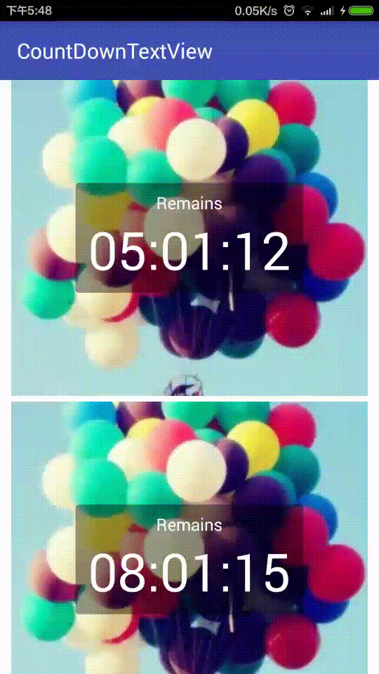

# CountDownTextView
A simple countdown widget and easy to use.

###Simple
------



###Usage
------

```` java
    compile 'com.ufreedom.countdowntextview:library:0.1.0'
````


You can give it a start time in the `SystemClock.elapsedRealtime` timebase, and it counts down from that.

By default it will not update the time value in text but give a callback `onTick()`,If you want to  display the current timer value ,Please use `setAutoDisplayText(true)`.

By default the display timer value is in the form "MM:SS" or "HH:MM:SS", you can use setTimeFormat() to use other  format :

| Time Format   | Display  |
| --------   |  ----  |
| TIME_FORMAT_D_H_M_S     | DD:HH:MM:SS | 
| TIME_FORMAT_H_M_S        |  HH:MM:SS   |  
| TIME_FORMAT_M_S        |   MM:SS    |  
| TIME_SHOW_S        |    SS  | 


``` java
long timeInFuture = SystemClock.elapsedRealtime + 1000 * 60 * 20;//20 minutes

CountDownTextView countDownTextView = findViewById(R.id.countDownTextView)
countDownTextView.setTimeInFuture(timeInFuture);
countDownTextView.setAutoShowText(true);
countDownTextView.start();

```


###Callback
------

``` java
    public interface CountDownCallback {

        /**
         * Callback fired on regular interval.
         * @param millisUntilFinished The amount of time until finished.
         */
        void onTick(CountDownTextView countDownTextView,long millisUntilFinished);

        /**
         * Callback fired when the time is up.
         */
        void onFinish(CountDownTextView countDownTextView);
        
    }
```


